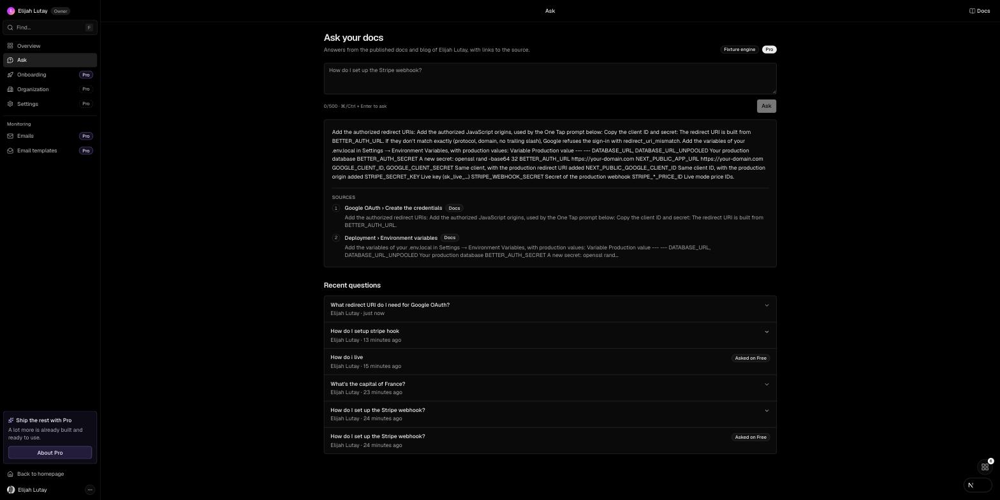
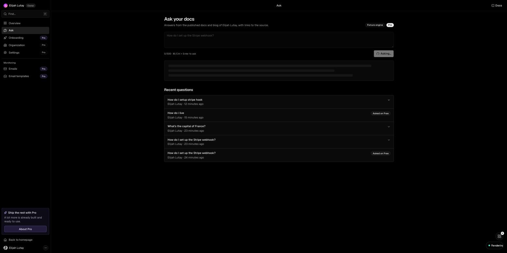

## Submission — Ask your docs (Elijah Lutay, 2026-10-02, 2-hour build)

### What I built
- `/dashboard/ask`: a member asks a plain-language question and gets an answer drawn only from `content/docs` and `content/blog`, with numbered citations that link to the exact page and section (`/docs/google-oauth#create-the-credentials`).
- A question the content doesn't cover gets "Your docs and blog don't cover this." and no citations.
- Plan gate: free organizations see the ask box and get an upgrade prompt; the server action enforces it and stores the question as gated. Pro and Business organizations, and platform admins, get answers.
- Per-organization history: the last 20 questions with asker and time, expandable to the stored answer without re-asking. Questions asked before an upgrade are labelled "Asked on Free".
- Metric (`node scripts/ask/smoke.ts`): **grounded 8/10, correct citation 8/10, off-topic refused 3/3, slowest 8 ms**, compared with minutes of browsing 14 pages by hand.
- Runs with **no LLM key and no Stripe**: the fixture engine is the default, and the plan comes from the `subscription` table.

### How to run
```bash
pnpm install
cp .env.example .env    # DATABASE_URL / DATABASE_URL_UNPOOLED (Neon), BETTER_AUTH_*, GOOGLE_CLIENT_*
env -u DATABASE_URL -u DATABASE_URL_UNPOOLED pnpm db:migrate
AI_FIXTURES=1 pnpm dev
```
- Sign-in is Google only, so `GOOGLE_CLIENT_ID` and `GOOGLE_CLIENT_SECRET` are required. Stripe and Anthropic keys are optional.
- `env -u …` is only needed in a shell that exports those variables as empty strings: `@next/env` and `process.loadEnvFile()` never override an existing variable, even an empty one.
- Flip a plan without Stripe: `env -u DATABASE_URL -u DATABASE_URL_UNPOOLED node scripts/ask/seed-plan.ts <email> <free|pro|business>`.
- Demo: the 9 steps in the README's **Ask your docs** section (free → gated → seed `pro` → cited answer → citation lands on the section → off-topic refused → second account sees only its own history → smoke script).
- Tests: there is no test runner in this repo. `node scripts/ask/smoke.ts` is the benchmark and exits non-zero below 8/10 or on any off-topic answer.

### Decisions & trade-offs
- **One new table, `ask_query`:** `organization_id` is non-null, indexed, and cascades on delete. It stores the citations as jsonb, plus the plan and engine mode at ask time, so the history replays the answer without re-asking. Gated questions are stored with `answer = null` rather than dropped.
- **Tenancy and auth:**
  - `askQuestion` runs `assertFeature("ask")`, then zod, then `getActiveOrganization()` (the session re-check inside the action), then the plan gate, then the insert.
  - `loadAskPage` filters on `organizationId = organization.id`.
  - The org id never comes from the client.
- **Plan gate reads `subscription` directly** (`reference_id = orgId`, status `active`/`trialing`) instead of `auth.api.listActiveSubscriptions`, because billing is off without Stripe env and that call wouldn't work locally.
- **Fixture engine:** IDF keyword scoring over MDX chunks split at headings, with a coverage threshold for refusing. Anchors use `github-slugger`, the same as Fumadocs, so citations land on the real heading. It is deterministic, needs no keys, and is logged at boot (`[ask] engine=fixture`) and shown as a badge on the page.
- **Migrations, not `db push`:** the repo already keeps migration files, so `drizzle/0001_*.sql` keeps the schema change reviewable.
- **Prototype-only:** keyword retrieval, extractive answers, no rate limiting, every org shares the starter's content. **Production-ready:** tenant scoping, the server-side plan gate, the schema and its indexes.

### What I cut and why
- Real Stripe checkout from the upgrade prompt: billing is off locally. The prompt links to `/dashboard/billing` when billing is on.
- Vector DB / embeddings: 14 short pages fit keyword retrieval; embeddings would need a second key.
- Chat with follow-ups: the brief asks for question and answer.
- Changelog and legal pages in the corpus: the brief says docs and blog only.
- Rate limiting and quotas: not a must-have; the plan gate is the only limit.
- Vitest/Playwright setup: no runner exists; the smoke script gives the signal.
- LLM engine (`engine/llm.ts`, a Should item): not built. The fixture engine is the only engine.
- Admin view across organizations: crosses tenants, not asked for.

### Known gaps
- **Answer text is rough:** the extractive answer flattens markdown tables and env-var lists into one paragraph ("Variable Production value --- ---"). The citations are right; the prose isn't. This is the first thing to fix (below).
- **Benchmark sits exactly at the threshold (8/10):** one regression fails it.
- **Copy with billing off:** the upgrade prompt says "Ask an owner to upgrade" even to an owner.
- **Mobile not visually checked:** the layout has `max-sm:` breakpoints, but the 390 px screenshot wasn't captured.
- **Build warning:** `modules/ask/corpus.ts` reads `content/` with computed `fs` paths, so Turbopack traces the whole project into the server bundle. The build passes, but before deploying, scope the paths (`path.join(process.cwd(), "content", "docs")`) or precompute the corpus at build time.
- `BETTER_AUTH_SECRET` in the local `.env` is short and low-entropy (Better Auth warns at boot). Generate a real one for any deploy.

### What's next (ranked)
1. LLM engine behind the same adapter (`ANTHROPIC_API_KEY`, top-5 passages, must cite, `grounded:false` when not covered), and clean the fixture answer by stripping tables and lists.
2. Raise the benchmark to 10/10 and add a Vitest runner for the corpus chunker and the scorer.
3. Per-organization content: tag MDX with `organizationId` once organizations can publish their own pages.
4. Streaming answers; feedback (helpful or not) and a usage count next to the plan.
5. Embedding retrieval (pgvector on Neon) when the corpus outgrows keyword scoring.

### Where AI helped and where it was wrong
- Ran 3 parallel Claude Code sessions in git worktrees: **a** (schema, plan gate, corpus, engine, action, loader), **b** (page and components), **c** (seed script, benchmark, smoke script, README). They built against a contract file committed on main first (`modules/ask/contracts.ts` plus stub signatures), and only **a** migrated the shared Neon DB.
- **Helped most with:** the corpus chunker and anchor slugs, the four UI states, and the benchmark harness. All three slices were MVP-complete by T+60.
- **Rejected or fixed:**
  - Slice b's `DEV_SAMPLE` preview history reached main despite its own "removed before final commit" note. Removed after the merge.
  - The history told a Pro org "Upgrade to see the answer" on questions asked before the upgrade, which contradicted the demo. Replaced with "Asked on Free".
  - The orientation map still said the DB was unset and planned a `lib/ask/` folder. Refreshed before the slices relied on it.
  - The answer prose from the fixture engine reads badly. Kept and documented rather than tuned during the freeze.
- **Not done:** no `reviewer-tester` pass ran on the slices; tenancy was verified by reading `modules/ask/{actions,queries,plan}.ts`.
- **Verified by:** a test merge of a + b + c in a throwaway worktree before the real merge (typecheck plus smoke), `sprint-wrap.sh --check-only` (typecheck and build pass), clicking the demo in Chrome (a cited answer for the Google OAuth question, no console errors), and a fresh-clone smoke test.

### Time log
- T+0–4 orient (map and conventions) · T+4–34 brief, contract and module registration · T+34–60 build in 3 worktrees · T+60–65 test merge, then merge a → b → c · T+65–81 seed the plan, walk the demo, polish · T+81–90 handover

### Screenshots



Walkthrough: <video link — recorded after submission>
